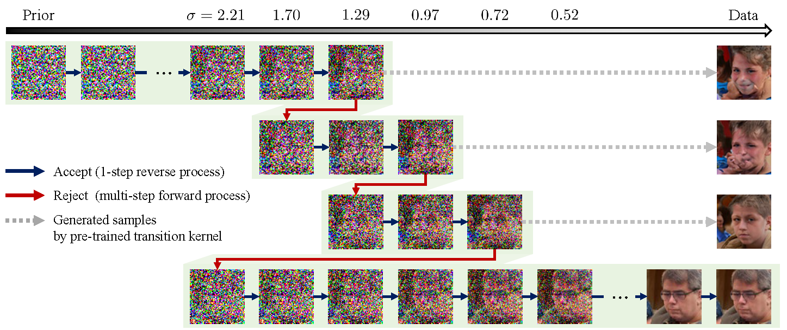
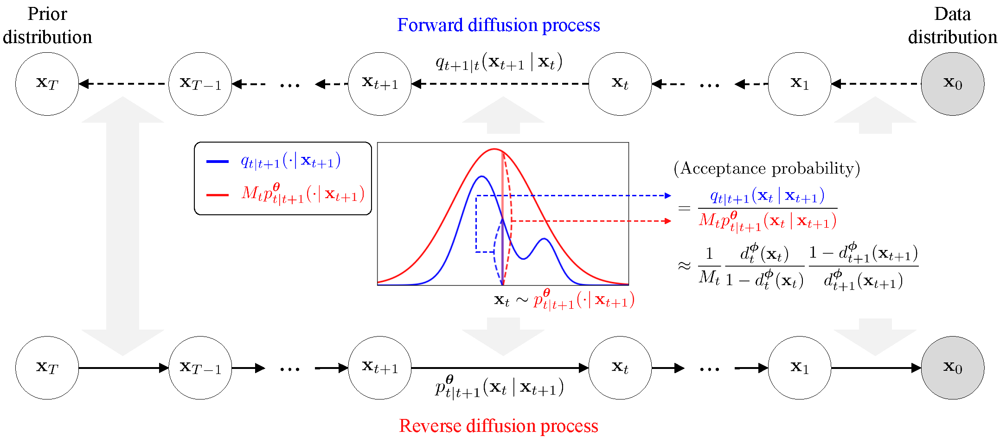

# Diffusion Rejection Sampling (DiffRS) (ICML 2024)

| [paper](https://proceedings.mlr.press/v235/na24a.html) | [arXiv](https://arxiv.org/abs/2405.17880) | [poster](https://icml.cc/media/PosterPDFs/ICML%202024/34559.png?t=1721399675.3276865) |

--------------------

This repo contains an official PyTorch implementation for the paper "Diffusion Rejection Sampling" in [ICML 2024](https://icml.cc/Conferences/2024).

**[Byeonghu Na](https://sites.google.com/view/byeonghu-na), [Yeongmin Kim](https://sites.google.com/view/yeongmin-space), Minsang Park, Donghyeok Shin, [Wanmo Kang](https://sites.google.com/site/wanmokang), and [Il-Chul Moon](https://aai.kaist.ac.kr/bbs/board.php?bo_table=sub2_1&wr_id=3)**   


--------------------

This paper introduces **Diffusion Rejection Sampling (DiffRS)**, a new diffusion sampling approach that ensures alignment between the reverse transition and the true transition at each timestep.





## Requirements

The requirements for this code are the same as [DG](https://github.com/aailabkaist/DG).

In our experiment, we utilized CUDA 11.4 and PyTorch 1.12.


## Diffusion Rejection Sampling

1. Download the pre-trained diffusion network and the trained discriminator network from DG.
  - Download '[edm-cifar10-32x32-uncond-vp.pkl](https://nvlabs-fi-cdn.nvidia.com/edm/pretrained/edm-cifar10-32x32-uncond-vp.pkl)' at [EDM](https://github.com/NVlabs/edm).
  - Download '[DG/checkpoints/discriminator/cifar_uncond/discriminator_60.pt](https://drive.google.com/drive/folders/1Mf3F1yGfWT8bO0_iOBX-PWG3O-OLROE2)' at [DG](https://github.com/aailabkaist/DG).
  - Download '[DG/checkpoints/ADM_classifier/32x32_classifier.pt](https://drive.google.com/drive/folders/1gb68C13-QOt8yA6ZnnS6G5pVIlPO7j_y)' at [DG](https://github.com/aailabkaist/DG).

2. Generate DiffRS samples using `generate_diffrs.py`. For example:

```.bash
python3 generate_diffrs.py \
    --network checkpoints/pretrained_score/edm-cifar10-32x32-uncond-vp.pkl \
    --outdir=samples/cifar10/diffrs --rej_percentile=0.75 --max_iter=105
```


## Acknowledgements

This work is heavily built upon the code from:
* [Kim, D., Kim, Y., Kwon, S. J., Kang, W., & Moon, I. C. (2023, July). Refining Generative Process with Discriminator Guidance in Score-based Diffusion Models. In *International Conference on Machine Learning (pp. 16567-16598). PMLR*.](https://github.com/aailabkaist/DG)

## Citation

```
@inproceedings{na2024diffusion,
  title = 	 {Diffusion Rejection Sampling},
  author =       {Na, Byeonghu and Kim, Yeongmin and Park, Minsang and Shin, Donghyeok and Kang, Wanmo and Moon, Il-Chul},
  booktitle = 	 {Proceedings of the 41st International Conference on Machine Learning},
  pages = 	 {37097--37121},
  year = 	 {2024},
  editor = 	 {Salakhutdinov, Ruslan and Kolter, Zico and Heller, Katherine and Weller, Adrian and Oliver, Nuria and Scarlett, Jonathan and Berkenkamp, Felix},
  volume = 	 {235},
  series = 	 {Proceedings of Machine Learning Research},
  month = 	 {21--27 Jul},
  publisher =    {PMLR},
}
```
